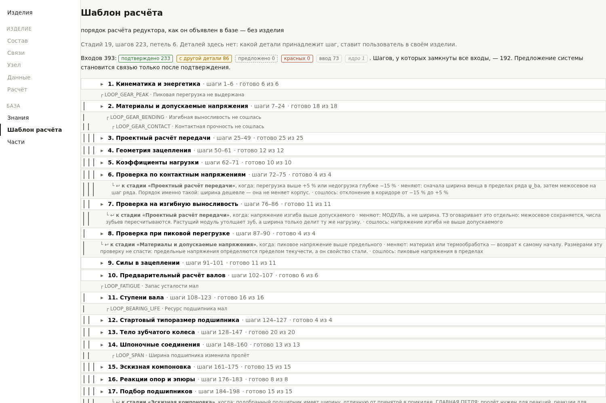

# Knowledge as data — two exhibits

*[Русская версия](README.ru.md)*

"The knowledge is stored as data, and an engineer edits it without programming"
is a claim that costs nothing until someone shows what it looks like. Here are
two files from the working base, copied verbatim, and an explanation of what to
look at in them.

- [`key-record.yaml`](key-record.yaml) — one record in full: the cross-section of
  a parallel key, chosen from the diameter of the shaft, per GOST 23360-78 (the
  counterpart of DIN 6885).
- [`template-fragment.yaml`](template-fragment.yaml) — the header of the
  calculation template, its first stage and one loop. The whole template is 223
  steps in 19 stages and 6 loops.

Both files are in Russian, because the base is. The structure is what matters
here, and it reads without the language.

---

## What it looks like in the window



The header line is the whole principle in one row of counters: **393 inputs of
the template — 233 confirmed, 86 crossing to another part, 0 suggested, 0 red,
73 entered by hand, 1 from the engine**, and *"a suggestion by the system becomes
a link only after it is confirmed."*

The system finds the candidates; a human confirms them one by one. The 319
confirmations behind those first two numbers were made by hand, step by step,
through this page. Where the system found several candidates and no rule to
choose between them, it does not choose — that is the red counter, and it is at
zero because every such case was resolved by a person, not by a default.

Under the stages sit the **loops**, each with the condition that sends the
calculation back, what it changes, and what counts as converged — for instance
*"to the stage «Design calculation of the pair», when the overload is above +5 %
or the underload deeper than −15 %; change the face width within the ψ_ba series
first, then the centre distance by one step of the series: the width is cheaper,
it does not move the housing."*

---

## Exhibit 1: a record

Sixty lines, and four things in them that ordinary calculation code does not
have.

**The source is named together with its maturity.**

```yaml
source: >
  ГОСТ 23360-78, таблица сечений призматических шпонок: сечение b×h
  назначается диапазону диаметров вала. ◐ ПЕРЕНЕСЕНО из redu_spec.md,
  п. 1; документ не сверялся.
```

*"GOST 23360-78, the table of parallel key cross-sections: the section b×h is
assigned to a range of shaft diameters. ◐ TRANSFERRED from redu_spec.md, item 1;
the document itself was not checked against."*

The sign `◐` means exactly that: transferred, not verified against the source
document. Verified and unverified differ by a mark, not by the author's memory.
Without it, a month later nobody can say where a number in the base came from —
and worse, everyone will assume it was checked.

**The rule for reading boundaries is written in words.**

> A diameter exactly on a boundary belongs to the LOWER row — 50 mm is still
> 14×9, not 16×10 — and no order of rows affects the choice.

This is precisely where people get it wrong: the interval is read as closed on
both sides, and a diameter of 44 falls into two rows at once. Which one wins is
then decided by the order of rows in the file.

**The record does not compute, it reads a standard.**

```yaml
range:
  table: keys.parallel.gost23360
  argument: d_mm
  bounds: over-to        # "over A, up to and including B"
  value: width_b_mm
```

There is no key section between rows — there is nothing to interpolate, and the
record does not pretend otherwise.

**The control examples say what they are verified against.**
`verified_against: source` — a number from the document, with the row quoted;
`invariant` — something that must hold by itself (the same diameter given in
centimetres yields the same answer). Three of the five examples sit on
boundaries deliberately: 50 is the end of an interval, 44 is not yet the start of
the next one, and 38.5 is a gap that existed while the intervals were written as
whole numbers.

**What the record does not contain is a part.** It does not know what it will be
applied to, and it does not decide that. Whether a formula suits a given part is
for the engineer to decide; the system only reports which inputs are missing.

---

## Exhibit 2: the calculation template

The template answers a question that is in no formula: **in what order to
compute**. Its header explains why that order lives in data rather than in code:

> "First materials, then the centre distance, then the geometry" does not follow
> from the dependencies between quantities and cannot be recovered from the
> code. Another author will order it differently and will be right.

Three decisions worth looking at.

**A step is declared by kind, not by body.** The template says "shaft", not
"input shaft": one order serves all shafts, and when laid over a product the
step is multiplied by the number of bodies of that kind.

**There are two sorts of step, and only two:** either `gives` — a quantity must
appear — or `verifies` — a condition must be checked. Combining them is
forbidden, and the reason is stated: a check that also produces a number would
hide the provenance of that number inside a verdict.

**Loops are declared, not implied.** A loop states where it returns from and to,
under what condition, what exactly it changes and in what order, what counts as
converged, and which budget of values it may walk through. Plus a diagnosis —
what it means when the loop will not converge:

> "the centre distance grows for the third time in a row" → the material of the
> wheel is too weak for the torque: raise the hardness or change the steel,
> rather than the size.

The motive is the same as for the maturity mark: a calculation without declared
loops shows as a straight line what is in fact a circle.

**And one mark worth noticing separately.** Inside that same loop it is written
that its budget is wider than permitted: the whole ψ_ba series is named, whereas
the specification allows only three of its values when the wheel sits
asymmetrically between the supports. The defect is not fixed — the loop has
never executed — but it is recorded in the place where whoever comes to write it
will walk into it.

---

## What follows

- **Changing the knowledge means editing yaml.** A new grade of steel, a
  different method, a corrected table need no programmer.
- **Every number has a provenance and a maturity**, and the second is as
  explicit as the first.
- **The choice stays with the human.** The system shows what it has and what it
  lacks; it does not choose between two correct formulas — why exactly, is in
  [the first case](../CASES.md).

## Limits

This is research, not a product. There are hundreds of records in the base, and
only some are backed by control examples. There is one template so far — a
single-stage cylindrical spur gearbox — and the current work is precisely about
breaking it into parts that transfer to other configurations and other types.

---

Serhii Klochko · [three cases](../CASES.md) · [github.com/sergeyy1021](https://github.com/sergeyy1021)
